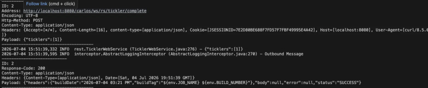
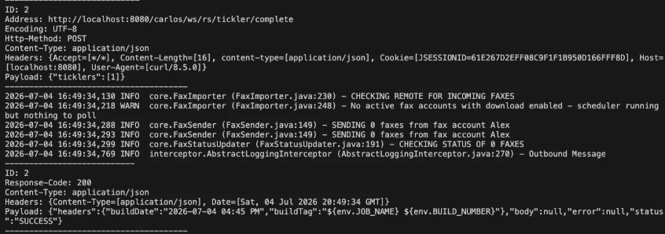

# Contribution 2: [Security] TicklerWebService logs raw JSON request bodies at INFO level #2982

**Contribution Number:** 2  
**Student:** Kevin Cortez  
**Issue:** [[GitHub issue link]](https://github.com/carlos-emr/carlos/issues/2982)  
**Status:** Phase IV Complete

**Contribution 3:** https://github.com/kpuentec/su26-ai301-contribution3
---

## Why I Chose This Issue

I chose this as my second contribution to CARLOS because it builds directly on my first. Where issue #2315 was about preventing malicious data from executing in the browser (XSS), this one is about preventing sensitive patient data from leaking into application logs (PHI exposure). Both are security issues at the output layer — one in HTML rendering, one in logging — and both follow the same pattern of data that shouldn't be there getting through unchecked.

The fix is well-scoped: one file, three methods, a clear before/after. I also have an established relationship with the maintainer from my first contribution. The issue references PR #2611 as a precedent for how safe logging has been handled elsewhere in the codebase, giving me a clear pattern to follow.

---

## Understanding the Issue

`TicklerWebService.java` logs the full JSON request body verbatim at INFO 
level in three mutation endpoints via `MiscUtils.getLogger().info(json.toString())`. 
Application logs are not an appropriate store for patient-correlating data. 
The `complete` and `delete` payloads contain tickler IDs, and the `update` 
payload is higher risk since it includes clinical task fields like `message`, 
`taskAssignedTo`, and `serviceDate`. Any log aggregation system or monitoring 
tool ingesting these logs now has a secondary store of patient-correlating data.

### Expected Behavior
The three mutation endpoints should either log nothing, or log only safe 
operational metadata (action name, count of ticklers processed, success/failure 
result) using `LogSafe.sanitize()` per the project's established convention 
from PR #2611.

### Current Behavior
All three methods call `MiscUtils.getLogger().info(json.toString())` 
immediately after the privilege check. The full raw JSON body — including 
tickler IDs, message text, task assignments, and service dates — is written 
to the application log at INFO level on every request.

### Affected Components
`src/main/java/io/github/carlos_emr/carlos/webserv/rest/TicklerWebService.java`:
- `completeTicklers()` — logs tickler ID array
- `deleteTicklers()` — logs tickler ID array
- `updateTickler()` — logs full tickler update payload including message 
  text and service date

---

## Reproduction Process

### Environment Setup

Same environment as Contribution 1 — CARLOS EMR running via Docker Desktop 
and docker-compose. Brought containers back up with `docker-compose up -d` 
and rebuilt with `export MAVEN_OPTS="-Xmx1512m -Xms512m" && make install`. 
Used `tail -f /usr/local/tomcat/logs/catalina.out` in one terminal to stream 
logs live while sending curl requests from another.

### Steps to Reproduce

1. Log into CARLOS at `http://localhost:8080/carlos`
2. Grab session cookie `JSESSIONID` from browser DevTools → Application → Cookies
3. Send a POST to `/tickler/complete`:
```bash
curl -X POST http://localhost:8080/carlos/ws/rs/tickler/complete \
  -H "Content-Type: application/json" \
  -H "Cookie: JSESSIONID=" \
  -d '{"ticklers":[1]}'
```
4. Observe the log output in `catalina.out`

**Expected:** No request body content in logs  
**Actual:** `INFO rest.TicklerWebService (TicklerWebService.java:276) - {"ticklers":[1]}` — full raw JSON logged at INFO level

### Reproduction Evidence

- **Branch:** https://github.com/kpuentec/carlos/tree/2982-bug-ticklerwebservice-phi-logging
- **Screenshots:**
  - 
- **My findings:** The log line fires before any business logic executes, 
  meaning even failed requests (e.g. invalid payload) still leak the full 
  JSON body to logs. All three endpoints confirmed affected via curl — 
  `completeTicklers` (line 276), `deleteTicklers` (line 302), and 
  `updateTickler` (line 359).

---

## Solution Approach

### Analysis

Root cause is three identical `MiscUtils.getLogger().info(json.toString())` 
calls in `TicklerWebService.java` — one each in `completeTicklers()` (line 276), 
`deleteTicklers()` (line 302), and `updateTickler()` (line 359). Each fires 
immediately after the privilege check, logging the complete request body before 
any processing occurs. The precedent for the fix is PR #2611, which established 
the `LogSafe.sanitize()` pattern for safe logging in this codebase.
### Proposed Solution

Remove the three raw log lines and replace with safe operational metadata 
logging at DEBUG level using `LogSafe.sanitize()`, following PR #2611's pattern.

### Implementation Plan

**Understand:** Three mutation endpoints log the full raw JSON request body at 
INFO level, potentially exposing tickler IDs, message text, and clinical task 
fields to application logs.

**Match:** PR #2611 established the pattern — use `LogSafe.sanitize()` for any 
identifier that must be logged, and use structured parameterized logging rather 
than raw object serialization.

**Plan:**
1. Replace `MiscUtils.getLogger().info(json.toString())` in `completeTicklers()` 
   with count-only debug log
2. Same replacement in `deleteTicklers()`
3. Replace in `updateTickler()` with sanitized ID debug log using `LogSafe.sanitize()`
4. Add `LogSafe` import
5. Add null guards on `json` parameter

**Implement:** https://github.com/kpuentec/carlos/tree/2982-bug-ticklerwebservice-phi-logging

**Review:** Match `LogSafe.sanitize()` pattern from PR #2611, DCO sign-off, 
target `develop`.

**Evaluate:** Re-run curl commands and confirm no raw JSON in `catalina.out`. 
Run `make install` to confirm no regressions.

---

## Testing Strategy

### Manual Testing
This fix removes three logging statements with no new business logic, so 
automated tests don't map cleanly onto it. Verified by tailing `catalina.out` 
while sending authenticated curl requests to each endpoint.

- **completeTicklers (line 276):** Before fix — `INFO rest.TicklerWebService (TicklerWebService.java:276) - {"ticklers":[1]}` in logs. After fix — no request body content, endpoint returns 200 SUCCESS.
- **deleteTicklers (line 302):** Same pattern confirmed — raw JSON line absent after fix.
- **updateTickler (line 359):** Full payload including message text logged before fix. After fix — no request body content in logs.
- **Regression check:** `make install` built clean. All three endpoints continue returning 200 SUCCESS.

**Before (raw JSON in logs):**


**After (no request body in logs):**


---

## Implementation Notes

### Week 2 Progress
Implemented the fix: removed three raw log calls and replaced with safe 
operational metadata at DEBUG level. Added `LogSafe` import. Applied null 
guards on `json` parameter per Gemini Code Assist feedback in a follow-up commit.

### Code Changes
- **Files modified:** `src/main/java/io/github/carlos_emr/carlos/webserv/rest/TicklerWebService.java`
- **Key commits:**
  - [4f617e6bb1](https://github.com/kpuentec/carlos/commit/4f617e6bb1) — "fix: remove raw JSON request body logging from tickler mutation endpoints"
  - [979ff6d40b](https://github.com/kpuentec/carlos/commit/979ff6d40b) — "fix: add null guard on json parameter in tickler debug log lines"
- **Approach decisions:** Followed the `LogSafe.sanitize()` pattern from PR #2611. Used DEBUG level so safe metadata is suppressed in production but available when debug logging is enabled. Added null guard on `json` parameter to prevent NPE on empty/malformed request bodies.

---

**PR Link:** https://github.com/carlos-emr/carlos/pull/3136

**PR Description:** Removes raw JSON request body logging from three tickler mutation endpoints in `TicklerWebService.java`, replacing verbatim `json.toString()` calls with safe operational metadata at DEBUG level using `LogSafe.sanitize()` to prevent PHI-correlating data from persisting in application logs.

**Maintainer Feedback:**
- **Jul 6:** Gemini Code Assist flagged missing null guards on `json` parameter across all three log lines — accessing `json.has()` directly could NPE on empty/malformed requests. Applied null guards in follow-up commit `979ff6d40b`.
- **Jul 6:** CodeRabbit suggested extracting a shared helper for the duplicate count expression — labeled trivial/low value. Not addressing unless Ben-Heerema requests it.

**Status:** Merged

---

## Learnings & Reflections

### Technical Skills Gained
- PHI logging risks in healthcare software and why application logs are not an appropriate store for patient-correlating data.
- `LogSafe.sanitize()` pattern and when to use DEBUG vs INFO level logging.
- How to reproduce a REST API vulnerability using curl with session cookies rather than relying on the UI.

### Challenges Overcome
- The Tickler Manager UI went through a different code path than the REST endpoints we needed to test — had to use authenticated curl requests with a session cookie grabbed from browser DevTools to hit the actual vulnerable endpoints.
- Initially missed the null guard on the `json` parameter — caught by Gemini Code Assist during PR review and fixed in a follow-up commit.

### What I'd Do Differently Next Time
- Add null guards upfront when writing any defensive log lines rather than waiting for a reviewer to flag it.
- Check earlier whether the UI actually triggers the specific endpoint being tested rather than assuming it does.

---

## Resources Used

## Resources Used
- [CARLOS CONTRIBUTING.md](https://github.com/carlos-emr/carlos/blob/develop/CONTRIBUTING.md)
- [Issue #2982](https://github.com/carlos-emr/carlos/issues/2982)
- [PR #2611 — Sanitize PHI-correlating identifiers in lab debug logging](https://github.com/carlos-emr/carlos/pull/2611)
